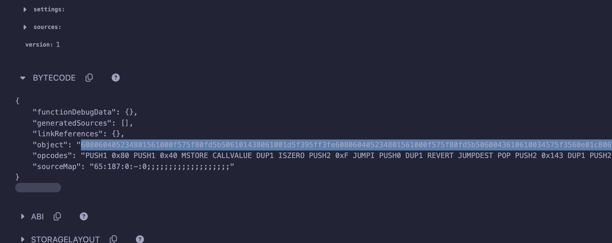
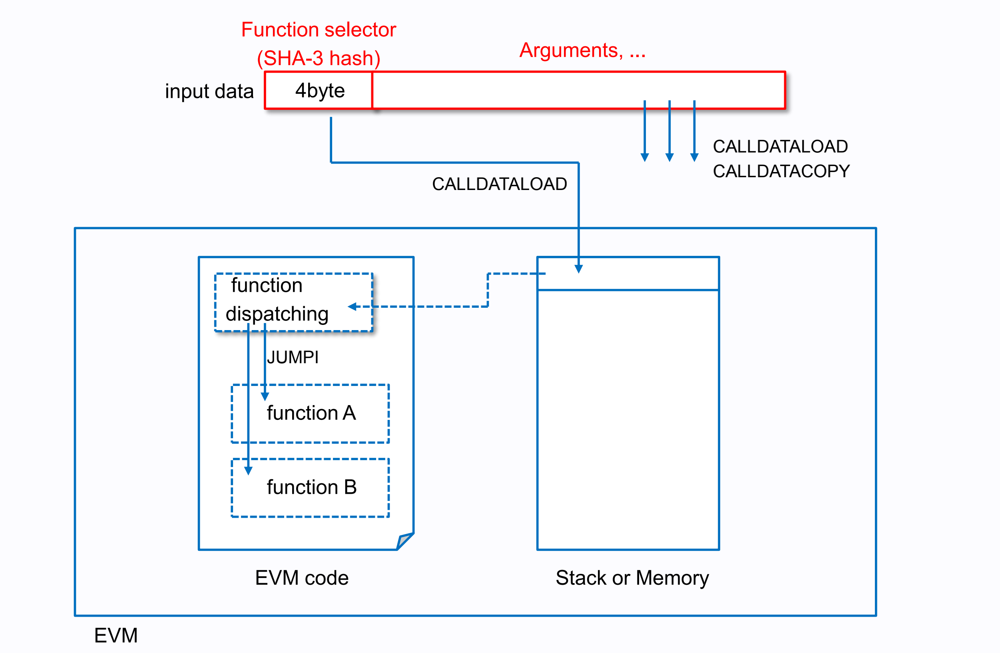
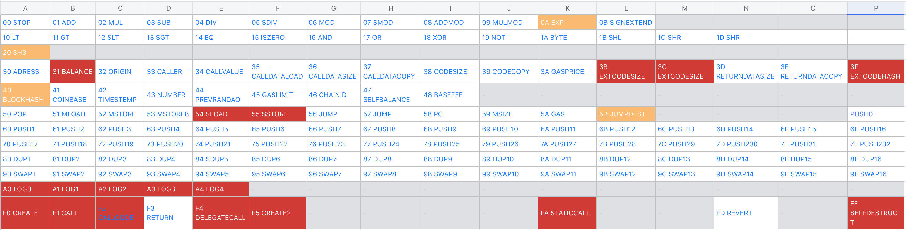
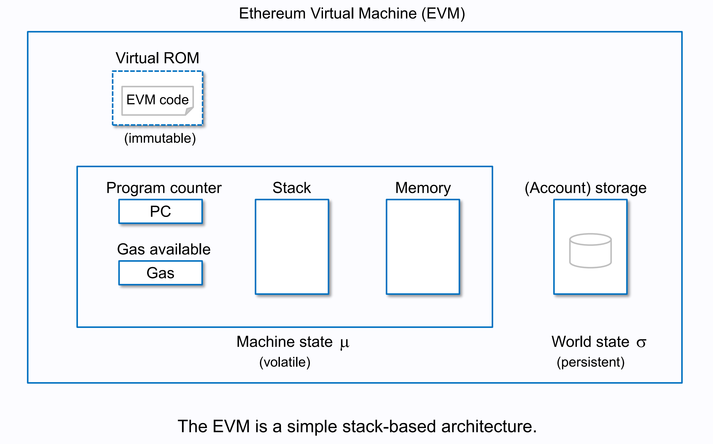
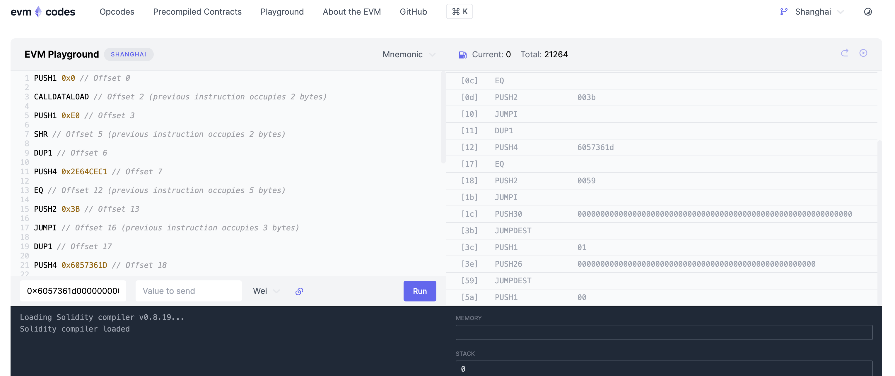

# EVM 基础

本来在我规划中我是要写一些基础知识介绍，但当我看到[EVM Deep Dives](https://noxx.substack.com/p/evm-deep-dives-the-path-to-shadowy)这个系列的文章后，我放弃了自己写的想法，因为这个系列文章写的太好了，还有我们的关注点水燃气消耗，关注燃气消耗的小伙伴应该都有一定的基础，所以偷个懒，这里把文章的内容简单介绍给大家。还是强烈推荐大家阅读原文。

EVM即以太坊虚拟机是区块链重要的组件，大部分智能合约是构建在EVM基础之上。要成为一名出色的 Solidity 开发人员，必须对 EVM 有深入的了解。

### Solidity → Bytecode → Opcode

Solidity代码需要先编译为Opcode字节码，然后才能部署到以太坊网络。Opcode字节码是EVM操作码指令。我们用一个简单的合约来讲解这个过程。

这是Solidity源码，在contracts/Case_000.sol，原文作者用0.8.19，不同版本编译得到的字节码会有些差异
```js
// SPDX-License-Identifier: MIT
pragma solidity >=0.7.0 <0.9.0;;

contract Case000 {
    uint number;
    function store(uint256 n) public {
        number =n;
    }

    function retrieve() public view returns (uint256) {
        return number;
    }
}
```
复制到Remix上之后，点击编译，在编译详情里可以看到字节码和操作码


字节码是16进制的字节数据，如下，转换成操作码后会有200多个操作码

```
608060405234801561001057600080fd5b50610150806100206000396000f3fe608060405234801561001057600080fd5b50600436106100365760003560e01c80632e64cec11461003b5780636057361d14610059575b600080fd5b610043610075565b60405161005091906100a1565b60405180910390f35b610073600480360381019061006e91906100ed565b61007e565b005b60008054905090565b8060008190555050565b6000819050919050565b61009b81610088565b82525050565b60006020820190506100b66000830184610092565b92915050565b600080fd5b6100ca81610088565b81146100d557600080fd5b50565b6000813590506100e7816100c1565b92915050565b600060208284031215610103576101026100bc565b5b6000610111848285016100d8565b9150509291505056fea26469706673582212209453c0d90bfbf32e8685c92f1d2700839324ba02bd5b19b85818a28998366ee964736f6c63430008130033
```

下面操作码命令片段是原文作者节选的一段关于合约里怎么选择进入哪个方法执行的逻辑
字节码表达如下
```
60003560e01c80632e64cec11461003b5780636057361d1461005957
```
翻译后得到
```
60 00                       =   PUSH1 0x00 
35                          =   CALLDATALOAD
60 e0                       =   PUSH1 0xe0
1c                          =   SHR
80                          =   DUP1  
63 2e64cec1                 =   PUSH4 0x2e64cec1
14                          =   EQ
61 003b                     =   PUSH2 0x003b
57                          =   JUMPI
80                          =   DUP1 
63 6057361d                 =   PUSH4 0x6057361d     
14                          =   EQ
61 0059                     =   PUSH2 0x0059
57                          =   JUMPI  	
```

对方法选择过程的描述图  [源于文档](https://takenobu-hs.github.io/downloads/ethereum_evm_illustrated.pdf)


[作者提供的逐条调试的EVM playground链接](https://www.evm.codes/playground?unit=Wei&callData=0x6057361d000000000000000000000000000000000000000000000000000000000000000a&codeType=Mnemonic&code=%27%210%7E0KCALLDATALOAD%7E2z2qw%21E0%7E3KSHR%7E5z2qwDUP1%7E6%28X4_2E64CEC1%7E7KEQ%7E12z5qwX2_3B%7E13%28*I%7E16z3qwDUP1%7E17KX4_6057361D%7E18KEQ%7E23z5qwX2_59%7E24K*I%7E27z3qwkY+wX30_0%7E28KwZGV59z31q%211%7E60+%7BG%7DW%7DKwkYwX26_0%7E62z2qKZstore%7Buint256V89z27q%210+ZContinueW.KK%27%7E+ZOffset+z+%7Bprevious+instruFoccupies+w%5Cnq%29s%7DwkZThes-ar-just+paddingNenabl-usNgetN_+0xZ%2F%2F+Yprogram+counter+59+%26+89XPUSHW+funFexecution...V%7D%29codew*DEST%7EN+to%28wwGretrieve%7BFction+-e+*JUMP%29+byte%28+K%21X1_%01%21%28%29*-FGKNVWXYZ_kqwz%7E_&fork=shanghai)

##### 操作码燃气简单说明
EVM opcode用1个字节来表示，每个操作有不同的收费规则，大多数的操作是固定收费的，比如ADD固定3gas，存储和内存相关的操作码会有更多收费细节。因为我们关注的是燃气优化，所以我们更关注那些消耗燃气多的opcode（红色 >=100gas），比如SLOAD和STORE等，通常在EVM中，与读写硬盘数据相关的操作都比较贵，计算和逻辑指令基本都在10gas以下。


### 智能合约函数调用

当我们调用合约函数时，我们会在提交交易中设置calldata调用数据，用于指定我们正在调用的函数签名以及需要传入的任何参数

当我们调用store方法并传入参数10时, calldata数据如下
```
0x6057361d000000000000000000000000000000000000000000000000000000000000000a

6057361d 是方法签名
后面带32bytes数据 uint256 10
000000000000000000000000000000000000000000000000000000000000000a 
```
当我们调用retrieve方法, calldata=0x2e64cec1

每个调用首先要指定调用的哪个方法，合约方法以签名的形式存在，签名4个字节

```js
// 函数签名定义为函数签名规范表示的 Keccak 哈希值的前四个字节
keccak256(“store(uint256)”) →  first 4 bytes = 6057361d

keccak256(“retrieve()”) → first 4 bytes = 2e64cec1
```

### EVM 架构
有了上面的基础阅读，现在我们可以试着来看一下EVM的架构图，可能对你理解合约交易运行会有帮助



### 推荐 EVM playground
EVM playground帮我们理解EVM中操作码的执行过程，以及相关堆栈、内存、存储和燃气消耗等信息的状态


其实我个人更推荐[Remix](https://remix.ethereum.org/)的Debug，显示的信息更全，我们所有案例也都是在Remix上调试的。

### 强烈推荐 
再次强烈推荐阅读[noxx 的 EVM Deep Dives系列文章](https://noxx.substack.com/)