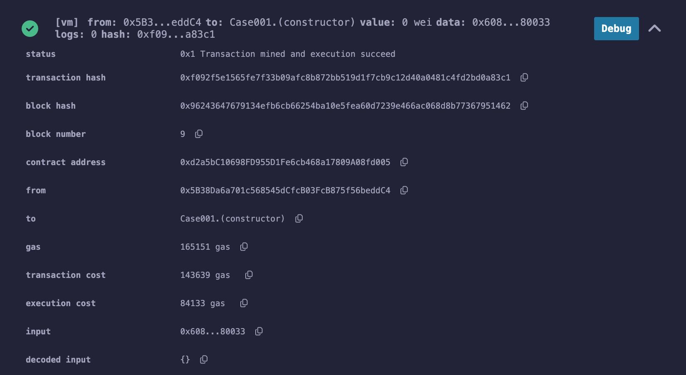
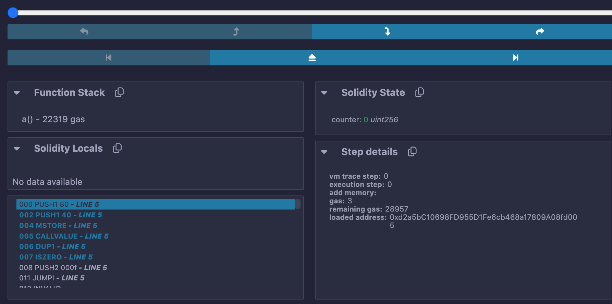
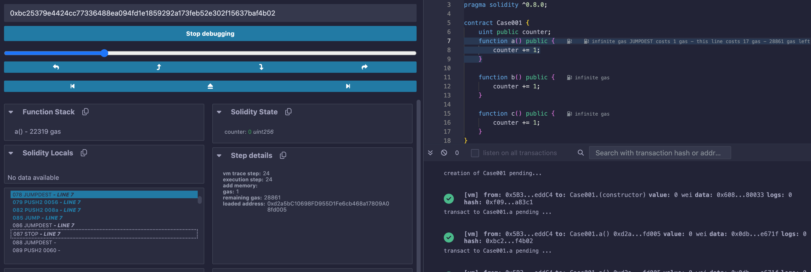
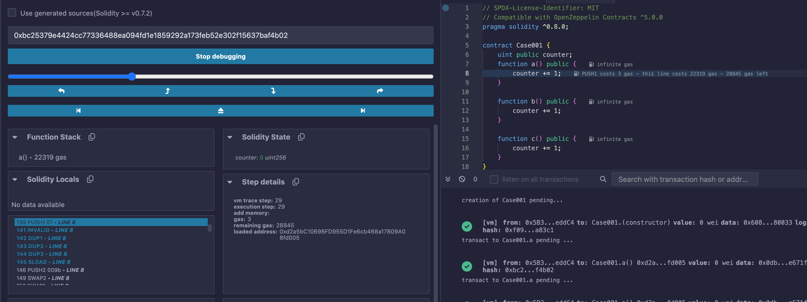
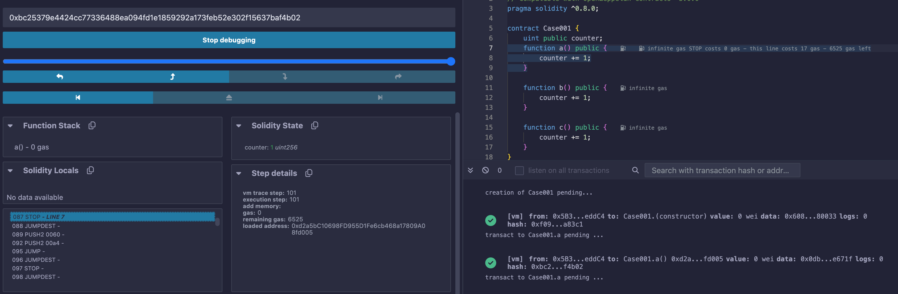
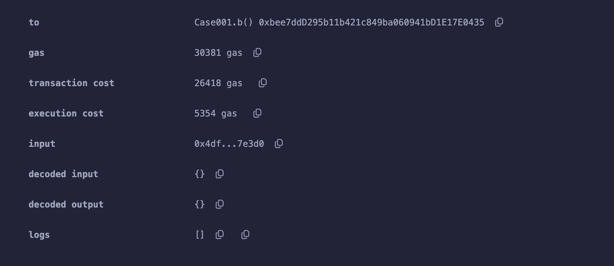
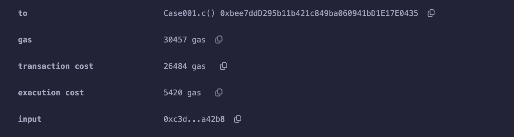
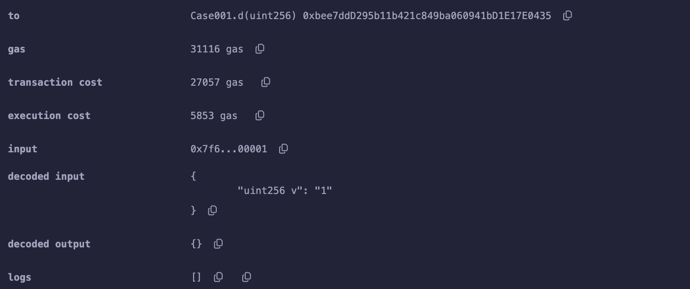
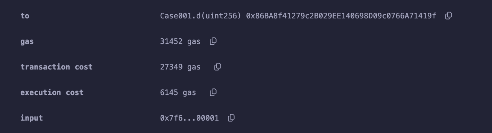

# 案例1 contracts/Case_001

我们实现了一个简单的计数合约，当然这个合约没啥实际使用价值，只是用来帮助我们理解一个合约方法的执行过程（其实区块链上可能绝大多数的智能合约都是毫无价值的垃圾合约🤦‍♂️）

合约代码如下，源码在contracts/Case_001.sol
```js
pragma solidity ^0.8.24;

contract Case001 {
    uint public counter;
    function a() public {
        counter += 1;
    }

    function b() public {
        counter += 1;
    }

    function c() public {
        counter += 1;
    }
}
```
在合约中我们实现了 a/b/c 3个功能完全相同的方法，那么当我们调用它们的时候会不会有相同的燃气消耗？为什么？

复制代码到Remix，然后部署并分别提交a/b/c方法两次，让我们来看看结果

每次执行后，我们可以看到交易具体信息，其中我们关注的是 【gas/transaction cost/execution cost/input】这4个信息



Method: 合约执行方法
Gas Limit：合约调用设置的燃气上限
Transaction Cost：交易燃气总消耗
Execution Cost：除去基本交易消耗外的燃气消耗（这个稍后解释）

| Method   | Gas Limit | Transaction Cost  | Execution Cost |
| -------- | -------- | -------- | -------- |
| a | 0x0dbe671f | 50021 | 43496 | 22432 |
| a | 0x0dbe671f | 30356 | 26396 | 5332  |
| b | 0x4df7e3d0 | 30381 | 26418 | 5354 |
| b | 0x4df7e3d0 | 30381 | 26418 | 5354 |
| c | 0xc3da42b8 | 30432 | 26462 | 5398 |
| c | 0xc3da42b8 | 30432 | 26462 | 5398 |

我们发现 除了a方法两次执行消耗了不一样的燃气外，两次b和两次c都消耗了同样的燃气，第一次a其实比第二次消耗了22432-5332=17100gas，这是为什么？

然后从第二次a执行，然后b的执行会更贵一些，c的执行会比b更贵一些，这是为什么？

首先我们来解释一下，为什么c执行逻辑燃气消耗（Execution Cost）只需要5398，而整个交易燃气消耗（Transaction Cost）却消耗了26462？
因为一个交易最基础的费用是21000，就好像公园门票，然后进去之后的项目和消费都是要再花钱的。

这里有一个注意的地方，在本文，从合约开始执行到进入方法的过程，我们把opcode=JUMPDEST作为流程的第一步，而后面文章，我们偶尔会把opcode=JUMPDEST作为上一个流程的最后一步，燃气统计会差1gas。

还有一个需要注意的是，不同的编译器版本生成的操作码列表会有差异，会影响调试的统计结果。

我们来调试一下第一次a执行的过程中，到底发生了什么





| State   | Step Start | Gas Cost  | Gas Left | State Gas Cost |
| -------- | -------- | -------- | -------- | -------- |
| 初始状态 | 0 | 21064 | 28957 | 96 |
| 加载a方法 | 24 | 21160 | 28861 | 16 |
| 执行counter+1 | 29 | 21176 | 28845 | 22319 |
| 执行counter+1完成 | 100 | 43495 | 6526 | 1 |
| 退出 | 101 | 43496 | 6525 | - |

我们发现，在合约执行的时候就已经使用了21064gas，交易最基础的收费21000多出了64gas，然后我们的calldata有4个字节（两个16进制数是1字节byte，每字节16gas * 4 = 64，所以是21064。

然后用了24步操作执行到a方法，也就是在执行a方法之前还要做一些操作。

然后字节码执行到第29个的时候，终于执行到counter+1的这个语句了，直到第99个字节码操作，都是counter+1这一句的执行过程，也就是要70个字节码操作（70步？不可置信吧，如果你把编译器调整到0.8.0之前，你会看到不一样的结果）。

然后是两个字节码操作退出执行，完成交易。关于字节码操作的内容我们会在后面讲；

在执行我们发现有一个SLOAD(step34)操作消耗了2100gas，还有一个SSTORE(step97)操作消耗了20000gas，这几乎占据了交易的绝大部分燃气消耗。

我们再来看看第二次a的调用的具体细节，我们就看结果，不展示截图了
记住初始gas limit=30356

| State   | Step Start | Gas Cost  | Gas Left | State Gas Cost |
| -------- | -------- | -------- | -------- | -------- |
| 初始状态 | 0 | 21064 | 9292 | 96 |
| 加载a方法 | 24 | 21160 | 9196 | 16 |
| 执行counter+1 | 29 | 21176 | 9180 | 5219 |
| 执行counter+1完成 | 100 | 26395 | 3961 | 1 |
| 退出 | 101 | 26396 | 3960 | - |

我们可以发现a第二次执行在counter+1这一步的gas跟a第一次执行不一样了，其他环节都一样，然后我们细心对比每一个操作发现，SSTORE(step97)这一步gas消耗变成了2900；当然我们大部分写合约的人肯定知道这其中的原因，我们也会在后面详细解释；

我们以同样的方式来调试一下b和c方法的执行

b 的初始 gas limit=30381
| State   | Step Start | Gas Cost  | Gas Left | State Gas Cost |
| -------- | -------- | -------- | -------- | -------- |
| 初始状态 | 0 | 21064 | 9317 | 118 |
| 加载b方法 | 29 | 21182 | 9199 | 16 |
| 执行counter+1 | 34 | 21198 | 9183 | 5219 |
| 执行counter+1完成 | 105 | 26417 | 3964 | 1 |
| 执行完毕，退出 | 106 | 26418 | 3963 | - |


c 的初始 gas limit=30432
| State   | Step Start | Gas Cost  | Gas Left | State Gas Cost |
| -------- | -------- | -------- | -------- | -------- |
| 初始状态 | 0 | 21064 | 9368 |
| 加载c方法 | 39 | 21226 | 9206 | 16 |
| 执行counter+1 | 44 | 21242 | 9190 | 5219 |
| 执行counter+1完成 | 115 | 26461 | 3971 | 1 |
| 执行完毕，退出 | 116 | 26462 | 3970 | - |

我们发现b的执行比a第二次执行燃气消耗更多，主要是在进入方法之前执行了更多步，消耗了更多的燃气，c比b在进入方法前消耗了更多的燃气。

如果我们在合约里把方法b和c的位置调换一下，b和c的燃气消耗会产生变化吗？ 答案是不会，合约执行是后搜索方法的顺序并不以sol文件里的顺序，而是编译后方法签名的排序。
编译后的方法签名 a()=0x0dbe671f | b()=0x4df7e3d0 || c()=0xc3da42b8 恰好也是跟abc字母排序一样的顺序

⚠️ 方法顺序在简单情况下是以上情况，当函数较多的复杂情况的排序会有不同（会用二分查找优化），后面会讲到。

##### 关于方法选择

如果我们看了上一篇EVM基础文章，我们会知道方法的选择过程是执行一组操作码，大概如下面，当我们合约里有abc3个方法时，要到达c方法必定经历匹配a和b方法失败的过。被框起来的部分就是一次失败的匹配的一组opcode，后面标记了每个opcode的燃气消耗，我们可以知道一次失败的匹配需要消耗22gas，这就是我们上面合约在进入abc方法前消耗为什么相差22*n了。

⚠️ 假如如果我们合约里11个方法，那每次进入第11个方法是否就要经历10次失败匹配之后才能进入目标？我们会在后面的章节讲到。

```
- 60 00                       =   PUSH1 0x00 
* 35                          =   CALLDATALOAD
- 60 e0                       =   PUSH1 0xe0
* 1c                          =   SHR
----------------------------------------------------|
* 80                          =   DUP1                | 3
- 63 2e64cec1                 =   PUSH4 0x2e64cec1    | 3
* 14                          =   EQ                  | 3
- 61 003b                     =   PUSH2 0x003b        | 3
* 57                          =   JUMPI               | 10
----------------------------------------------------| 
* 80                          =   DUP1 
- 63 6057361d                 =   PUSH4 0x6057361d     
* 14                          =   EQ
- 61 0059                     =   PUSH2 0x0059
* 57                          =   JUMPI  
```

我们如何在0x格式的字节码里找到方法选择的部分，上面标记*号的opcode是关键标记，方法选择字节码符合以下格式，我们一般在字节码里定位3560e01c，后面跟随的部分就是具体选择过程，其中14（EQ）前8/4/2位就是方法签名。注意方法签名不一定是4bytes，当我们对方法压缩时，比如当方法是0x0000988c时，opcode=PUSH2 988c。

`3560e01c 80[63/62/61][function_signature]1461[line]57 80[63/62/61][function_signature]1461[line]57`
##### 更进一步

如果我们加上方法d()呢，你不妨试一试
d()=0x8a054ac2 😊

我们确实要添加一个d方法，但不在简单的+1，我们要把事情搞得更复杂一些
我们添加了一个新的方法，带有一个参数，并添加了一句意义不大的m=v+1，然后counter+m
```js
function d(uint v) public {
    uint m = v + 1;
    counter += m;
}
```





添加了d方法后，我们重新再提交每个方法的交易后发现，d的加入，让原来的c的燃气消耗改变了，但是a,b没有变化，因为d的方法签名0x7f6b590c恰好排在b和c之间。

| Method   | Gas Limit | Transaction Cost  | Execution Cost |
| -------- | -------- | -------- | -------- |
| a | 0x0dbe671f | 30356 | 26396 | 5332  |
| b | 0x4df7e3d0 | 30381 | 26418 | 5354 |
| c-old | 0xc3da42b8 | 30432 | 26462 | 5398 | 
| c | 0xc3da42b8 | 30457 | 26484 | 5420 |
| d | 0x7f6b590c | 31116 | 27057 | 5853 |

calldata=`0x7f6b590c0000000000000000000000000000000000000000000000000000000000000001`
我们会发现，d会比b多消耗639gas，calldata变化只增加了140gas，另外500gas消耗在哪里了，让我们打开调试模式
d 的初始 gas limit=31116
| State   | Step Start | Gas Cost  | Gas Left | State Cost |
| -------- | -------- | -------- | -------- | -------- |
| 初始状态 | 0 | 21204 | 9912 | 162 |
| 加载方法d(uint) | 39 | 21366 | 9750 | 272 |
| 执行m=v+1 | 123 | 21638 | 9478 | 209 |
| 执行counter+1 | 190 | 21847 | 9269 | 5209 |
| 执行counter+1完成 | 258 | 27056 | 4060 | 1 |
| 执行完毕，退出 | 259 | 27057 | 4059 | - |

我们发现方法加载比原来多消耗256gas以及m=v+1消耗了209gas这是消耗增多的主要原因，当我们参数增加的情况下，实际上不止是calldata数据增加需要消耗燃气，方法加载中参数加载也消耗燃气。然后就是我们发现一句简单的 n+=1 语句，需要将近70步操作来完成，需要消耗200+gas。进入第一个方法的过程需要消耗96gas。

```js
function d(uint v) public returns (uint) {
    uint m = v + 1;
    counter += m;
    return counter;
}
```

| Method   | Gas Limit | Transaction Cost  | Execution Cost |
| -------- | -------- | -------- | -------- |
| b | 0x4df7e3d0 | 30381 | 26418 | 5354 |
| d | 0x7f6b590c | 31116 | 27057 | 5853 |
| d-new | 0x7f6b590c | 31452 | 27349 | 6145 |



哇 一个return语句，增加了125gas？确实如此，读了一次counter存储就消耗了100gas。

d 的初始 gas limit=31452
| State   | Step Start | Gas Cost  | Gas Left | State Cost |
| -------- | -------- | -------- | -------- | -------- |
| 初始状态 | 0 | 21204 | 10248 | 162 |
| 加载方法d | 39 | 21366 | 10086 | 274 |
| 执行m=v+1 | 124 | 21640 | 9812 | 196 |
| 执行counter+m | 186 | 21836 | 9616 | 5211 |
| return语句  | 256 | 27047 | 4405 | 125 |
| 退出方法 | 265 | 27172 | 4280 | 177 |
| 执行完毕 | 320 | 27349 | 4103 | - |

#### 总结一下

希望通过这个简单又有点啰嗦的案例，能让大家认识到交易执行过程中主要的几个燃气消耗组成部分
1. 基础21000gas；
2. 根据calldata收费，规则是byte值为0则4gas/byte，非0值则16gas/byte；
3. 进入方法的过程收费，根据方法名排序有所不同，当方法少的时候消耗大概x+n*22gas，方法多的时候会有优化；
4. 方法加载，根据参数不同而变化；
5. 方法执行燃气消耗；
6. 返回语句及方法退出时燃气消耗；

当然以上只是简单介绍了一个交易执行过程中燃气都消耗在了那里，我们用一个简单的计数逻辑来演示，真实的情况远比这复杂的多。我们发现在我们的案例中，交易执行过程消耗的燃气基本都在5300以上，这其中读counter到内存和写回修改后数据消耗的2100 + 2900 gas时必然的，尽管案例如此简单，通过一些魔法操作，还是有压缩的空间的，加油吧小伙伴 😊！