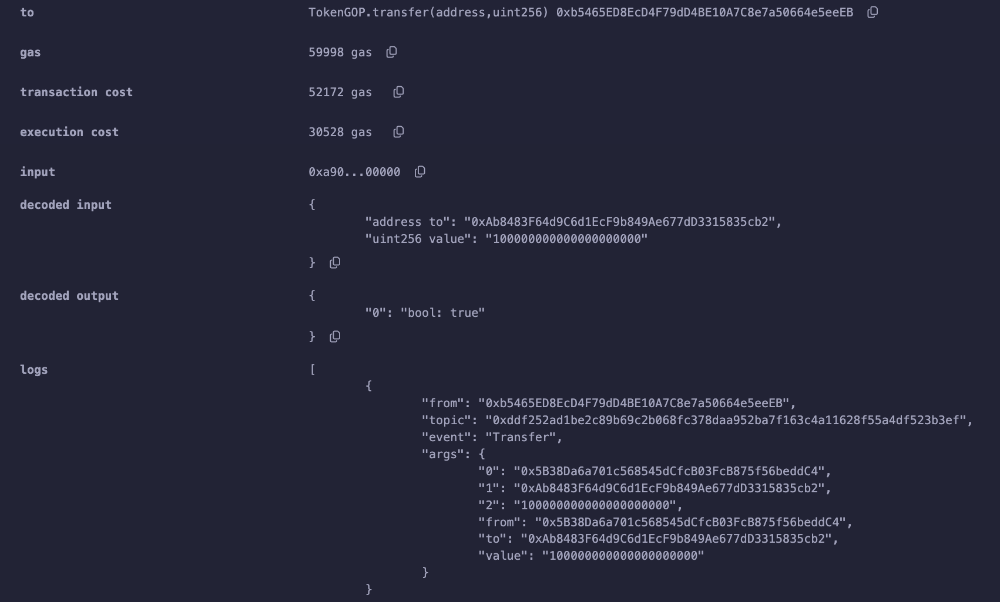
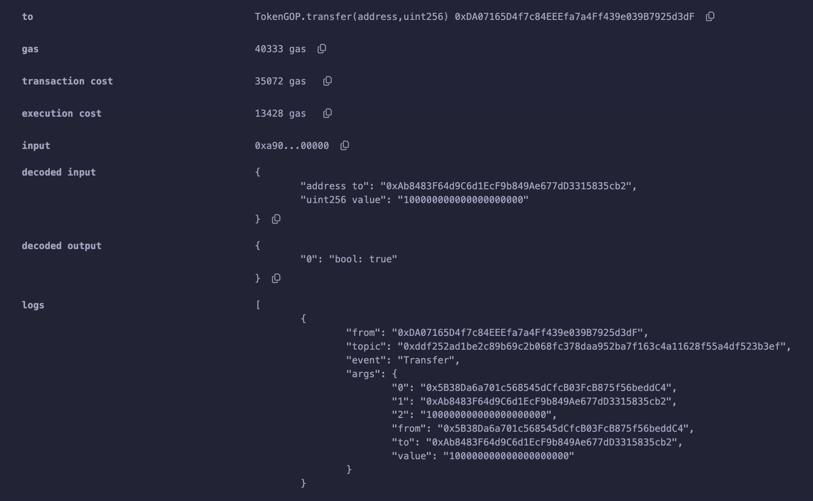
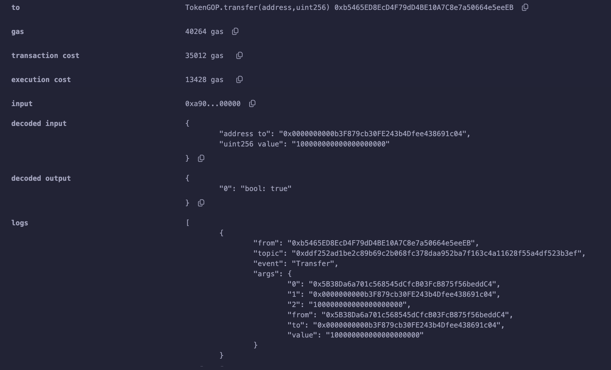
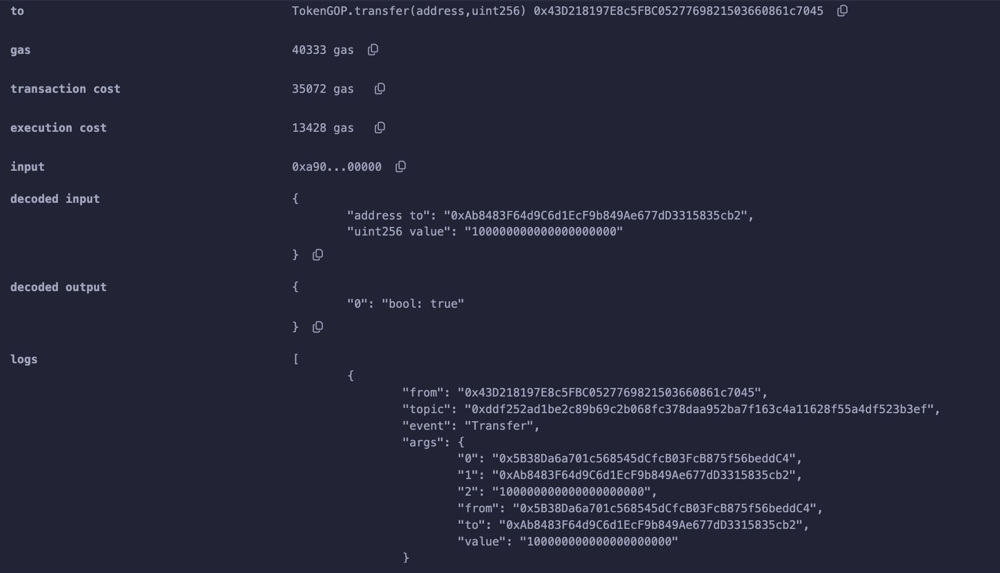
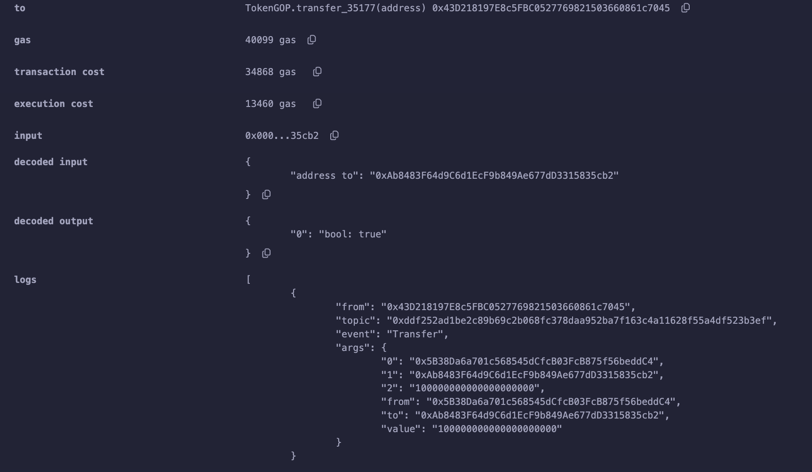
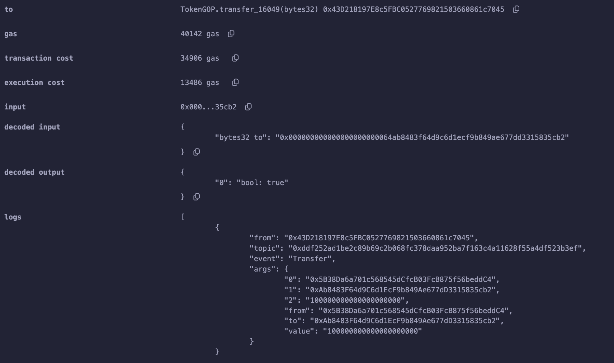

# Calldata 燃气计算规则及优化方法

### 从一笔ERC20转账开始
本章用一个ERC20转账交易来开始介绍calldata的构成，创建一个叫做GOP的ERC20的合约，合约源码在contracts/Case_002.sol，请放心使用，这是用openzeppelin工具生成的一个标准ERC20，这里只是增加几个多余的转账方法来做些测试。

使用Remix，将TokenGOP合约部署，部署后部署合约的地址将会得到10000个GOP（10000 * 10 ** 18wei），然后向Remix生成的第二个地址进行一笔转账，参数如下

0xAb8483F64d9C6d1EcF9b849Ae677dD3315835cb2,100000000000000000000

复制一下calldata，会得到一下16进制的一串字节
`0xa9059cbb000000000000000000000000ab8483f64d9c6d1ecf9b849ae677dd3315835cb20000000000000000000000000000000000000000000000056bc75e2d63100000`

calldata是由方法签名和参数列表拼接在一起的的一个字节数组，以16进制的字符形式放在交易对象的data字段中，因为是16进制，所以每两个16进制数是一个字节。
```
0x
a9059cbb // transfer 方法签名 4bytes 
// 0xAb8483F64d9C6d1EcF9b849Ae677dD3315835cb2  20bytes 地址 + 12bytes的前置补零
000000000000000000000000ab8483f64d9c6d1ecf9b849ae677dd3315835cb2
// 100000000000000000000 的十六进制值 56bc75e2d63100000 前置补零
0000000000000000000000000000000000000000000000056bc75e2d63100000
```

方法签名是对方法声明取Hash并截取前4个bytes作为签名，比如ERC20的transfer方法

```js
// 方法定义
function transfer(address to, uint256 value) external returns (bool);
// 方法声明 -> transfer(address,uint256)，对其做hash得到32bytes的字节数组
keccak256('transfer(address,uint256)') = 0xa9059cbb2ab09eb219583f4a59a5d0623ade346d962bcd4e46b11da047c9049b
// 取前4字节，也就是前八个16进制数作为方法签名即 0xa9059cbb
```
小于32bytes的参数首先要encode成32bytes字节，然后按顺序拼接给calldata

对于复杂的参数，放到文章最后来讲。

刚刚的转账交易提交后，查看结果可以看到这个转账花费了52172gas，然后打开调试模式可以发现（Remix交易结果消息后的Debug按钮），在交易开始的时候，就已经消耗了21644gas，减去21000的交易初始费用，calldata消耗了644gas。



### calldata燃气消耗计算规则

计算规则：字节值为0的4gas/byte，非0字节16gas/byte;

需要注意的是，因为这是16进制表示，每两个16进制数是一个byte。
```
0x
方法签名 4 * 16 = 64 gas
a9059cbb 
地址参数 24个0及40个非0，也就是 12bytes * 4 + 20ytes * 16 = 368 gas
000000000000000000000000ab8483f64d9c6d1ecf9b849ae677dd3315835cb2
4 * 25ytes + 16 * 7ytes = 212 gas
0000000000000000000000000000000000000000000000056bc75e2d63100000

64 + 368 + 212 = 644
```
写了一个关于calldata燃气消耗计算的简单脚本scripts/calldata_gas.js。

推荐阅读的内容里有Gethcalldata燃气消耗计费相关实现的源码Github链接。

### 换个收款地址试试
用地址 0x0000000000b3F879cb30FE243b4Dfee438691c04 （GasToken2账户）进行同样数额的一笔转账试试，可以看到这个转账花费了52112gas，比上一笔少了60gas。然后计算这笔交易calldata消耗了584gas，正是交易燃气消耗减少部分。因为GasToken2的地址有10个0的前缀，也就是5个0字节。

calldata=`0xa9059cbb0000000000000000000000000000000000b3f879cb30fe243b4dfee438691c040000000000000000000000000000000000000000000000056bc75e2d63100000`


### 重复转账试一试
分别再向两个地址转账100Token，发现每笔转帐都比上一笔便宜了17100，为什么？如果你有合约开发经验一定是知道的。如果没有，后面的章节会讲到。



### 如何优化这一部分燃气
#### 方法签名压缩
首先可以通过将方法的4字节压缩到1字节（甚至是8个0），因为多了3字节0，每字节节省12gas，可以节省36gas；推荐的压缩方式是循环尝试在方法名后面加一个数字，经过大量的尝试，肯定会找到含有多个0字节的签名，我在scripts/func_signature.js中实现了一个简单的方法，可以试用一下。
#### 参数压缩
参数部分压缩需要用一些变通的方法了，比如能不能用msg.value来代替一个小数值参数，因为ETH以wei为单位，有时候可以在在msg.value带一个值，来代替一些参数，msg.value值不影响燃气费，比如有时用一个参数来表示true/false，如果用数字1来表示，需要4*31+16=140gas，用value来代替就可以的节省燃气。或者把地址之前那24个零用上，比如它可以表达一个uint12的整数。事实上当我少一个参数的时候，不仅calldata燃气消耗少了，方法加载的过程也节省了部分燃气。

尝试去改造一下transfer方法，看看燃气有没有优化掉一部分

在contracts/Case_002.sol中尝试加了三个与transfer功能基本一致的方法，不过遗憾的是，修改后的方法只能转账整数*10**18个token
```js
// transfer 原本实现
// function transfer(address to, uint256 value) public virtual returns (bool) {
//     address owner = _msgSender();
//     _transfer(owner, to, value);
//     return true;
// }

function transfer_35177(address to) public payable returns (bool) {
	address owner = _msgSender();
	_transfer(owner, to, msg.value * (10 ** 18));
	return true;
}

function transfer_16049(bytes32 to) public returns (bool){
	address owner = _msgSender();
	_transfer(owner, address(bytes20(to << 96)), uint(uint96(bytes12(to))) * (10 ** 18));
	return true;
}
```

首先调用transfer给账户 0xAb8483F64d9C6d1EcF9b849Ae677dD3315835cb2 转账100个token，然后依次分别提交3个修改后的transfer来看下结果，注意填写正确的参数和value值

参数：0xAb8483F64d9C6d1EcF9b849Ae677dD3315835cb2,100000000000000000000
value: 0

calldata=`0xa9059cbb000000000000000000000000ab8483f64d9c6d1ecf9b849ae677dd3315835cb20000000000000000000000000000000000000000000000056bc75e2d63100000`

| Method   | Gas Limit | Transaction Cost  | Base Cost | Calldata Cost | Execution Cost |
| -------- | -------- | -------- | -------- | -------- | -------- |
| transfer | 40333 | 35072 | 21000 | 644 | 13428 |



##### 提交 transfer_35177
参数：0xAb8483F64d9C6d1EcF9b849Ae677dD3315835cb2
value: 100

calldata=`0x00005cfc000000000000000000000000ab8483f64d9c6d1ecf9b849ae677dd3315835cb2`

| Method   | Gas Limit | Transaction Cost  | Base Cost | Calldata Cost | Execution Cost |
| -------- | -------- | -------- | -------- | -------- | -------- |
| transfer       | 40333 | 35072 | 21000 | 644 | 13428 |
| transfer_35177 | 40099 | 34868 | 21000 | 408 | 13460 |
| gas save       | - | 204 | - | 236 | -32 |

transfer_35177对比transfer节省了204gas，其中calldata节省236gas，但amount计算的时候花了更多的gas，所以整体值节约204gas，通过优化语句可以节省更多。



##### 提交 transfer_16049

参数需要把地址前面的两个0改成64，0x64=100（十进制）
参数 0x000000000000000000000064ab8483f64d9c6d1ecf9b849ae677dd3315835cb2
value： 0

calldata=`0x0000988c000000000000000000000064ab8483f64d9c6d1ecf9b849ae677dd3315835cb2`

| Method   | Gas Limit | Transaction Cost  | Base Cost | Calldata Cost | Execution Cost |
| -------- | -------- | -------- | -------- | -------- | -------- |
| transfer       | 40333 | 35072 | 21000 | 644 | 13428 |
| transfer_16049 | 40142 | 34906 | 21000 | 420 | 13486 |
| gas save       | - | 166 | - | 224 | -58 |

transfer_16049对比transfer节省了166gas，其中calldata节省224gas，但参数拆解的时候花了更多的gas，通过优化语句可以节省更多。



其实在有些场景下，一些方法原本使用很长的参数列表，留给我们优化的空间很大。calldata在很早的EVM版本中收费是68gas/byte，所以以前的参数优化收益更多。

#### 燃气消耗分析
```js
// transfer_35177(address) 方法签名是 0x00005cfc
// start 40099 - 21048 = 18691
// 18691 - 18573 = 118 
function transfer_35177(address to) public payable returns (bool) { // step 29-128 18573 - 18251 = 322gas 
    address owner = _msgSender(); // step 129-142 18251 - 18207 = 44gas
	_transfer(owner, to, msg.value * (10 ** 18)); // step 143-434  18207 - 5435 = 12772gas
	return true;
	// step 435-500 5435 - 5231 = 204gas

// transfer_16049(bytes32) 方法签名是 0x0000988c
// start 40142 - 21420 = 18722
// 18722 - 18582 = 140
function transfer_16049(bytes32 to) public returns (bool) { // step 34-125 18582 - 18284 = 298
	address owner = _msgSender(); // step 126-139 18284 - 18240 = 44gas
	_transfer(owner, address(bytes20(to << 96)), uint(uint96(bytes12(to))) * (10 ** 18)); // step 140-440 18240 - 5440 = 12800gas
	return true;
	// step 440-506 5440 - 5236 = 204gas
}

// transfer(address,uint256) 方法签名是 0xa9059cbb 
// start 40333 - 21644 = 18689
// 18689 - 18551 = 138 
function transfer(address to, uint256 value) public virtual returns (bool) { // step 32-190 18551 - 18036 = 525gas
	address owner = _msgSender(); // step 191-204 18036 - 17992 = 44gas
	_transfer(owner, to, value); // step 205-420 17992 - 5466 = 12526
	return true;
	// step 421-486 5466 - 5261 = 205
}
```

### 合约中的方法查找过程
这是合约中方法选择部分的字节码，做了一些注释说明，惊讶的发现，原来方法查找用了二分法，在方法列表>=8时，会被二分成两个队列。
```
3560e01c
8063 313ce567 11 61009457 // if 313ce567 GT func_signature, JUMP 0x94
8063 8da5cb5b 11 61006357 // if 8da5cb5b GT func_signature, JUMP 0x63

8063 8da5cb5b 14 61034d57 // -> owner()
8063 95d89b41 14 61037757 // -> symbol()
8063 a9059cbb 14 6103a157 // -> transfer()
8063 dd62ed3e 14 6103dd57 // -> allowance(address,address)
8063 f2fde38b 14 61041957 // -> transferOwnership(address)
6100f556 // no matched, to fadeback
5b // JUMPDEST location 0x63 = 99
8063 313ce567 14 6102a957 // -> decimals()
8063 40c10f19 14 6102d357 // -> mint(address,uint256)
8063 70a08231 14 6102fb57 // -> balanceOf(address)
8063 715018a6 14 61033757 // -> renounceOwnership()
6100f556 // no matched, to fadeback
5b // JUMPDEST location 0x94 = 148
8063 06fdde03 11 6100d057 // if 06fdde03 GT func_signature, JUMP 0xd0
8063 06fdde03 14 6101dd57 // -> name()
8063 095ea7b3 14 61020757 // -> approve(address,uint256)
8063 18160ddd 14 61024357 // -> totalSupply()
8063 23b872dd 14 61026d57 // -> transferFrom(address,address,uint256)
6100f556 // no matched, to fadeback
5b // JUMPDEST 字节位置 0xd0 = 208
8061 4683 14 6100f957 // -> transfer_86559(address,uint256)
8061 5cfc 14 61013557 // -> transfer_35177(address,uint256)
8061 988c 14 61016557 // -> transfer_16049(address,uint256)
8061 e132 14 6101a157 // -> transfer_71446(address,uint256)
5b
```

### Calldata中复杂参数编码

**TODO**

### 推荐阅读
[calldata 燃气计算 eth源码](https://github.com/ethereum/go-ethereum/blob/v1.10.20/core/state_transition.go#L118)
[transation 执行燃气计算相关源码](https://github.com/ethereum/go-ethereum/blob/v1.10.20/core/state_transition.go#L275)


