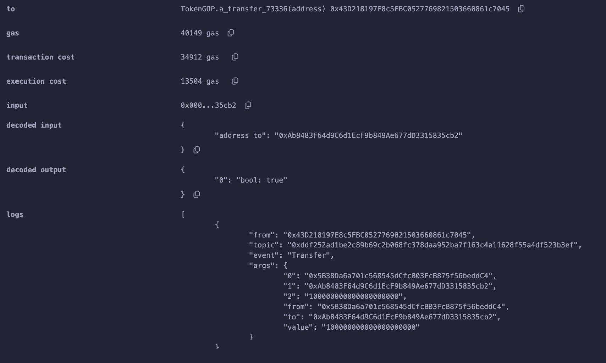

# 案例2 contracts/Case_002

为了更好的举例，我们用一个ERC20转账交易来开始介绍calldata的构成，我们在contracts里准备了一个ERC20_GOP的合约，请放心使用，因为这是用openzeppelin工具生成的一个标准ERC20.

我们Token GOP部署，然后先转账给我们第2个地址一笔些GOP，比如 100 * 10 ** 18 个 ，也就是100后面再加18个0

0xAb8483F64d9C6d1EcF9b849Ae677dD3315835cb2,100000000000000000000

我们可以复制一下calldata，会得到一下16进制的一串字节
`0xa9059cbb000000000000000000000000ab8483f64d9c6d1ecf9b849ae677dd3315835cb20000000000000000000000000000000000000000000000056bc75e2d63100000`

将字节截断，我们知道他的组成了
```
0x
a9059cbb // 4字节的方法标记 transfer
// 0xAb8483F64d9C6d1EcF9b849Ae677dD3315835cb2 地址补0成为32byte
000000000000000000000000ab8483f64d9c6d1ecf9b849ae677dd3315835cb2
// 100000000000000000000 的16进制 + 补0前缀
0000000000000000000000000000000000000000000000056bc75e2d63100000
```
calldata组成方式 TODO


通过交易结果，我们知道这个转账花费了52172gas，我们打开调试模式可以发现，在交易开始的时候，就已经消耗了21644gas，所以calldata消耗了644gas。


### calldata燃气计算

计算规则就是 值为0的字节4gas/byte，非0字节16gas/byte;
需要注意的是，因为这是16进制表示，每两个16进制数是一个byte。
```
64 + 368 + 212 = 644
0x
// transfer方法标记4字节 4 * 16 = 64 gas
a9059cbb 
// 地址 24个0及40个非0，也就是 12 * 4 + 20 * 16 = 368 gas
000000000000000000000000ab8483f64d9c6d1ecf9b849ae677dd3315835cb2
// 4 * 25 + 16 * 7 = 212
0000000000000000000000000000000000000000000000056bc75e2d63100000
```
我写了一个关于calldata燃气消耗计算的脚本 scripts/calldata_gas.js，下面也添加了GETH相关计算实现的源码。

### 换个收款地址试试
我们地址 0x0000000000b3F879cb30FE243b4Dfee438691c04 （GasToken2账户）进行同样数额的一笔转账试试（别担心，这个转账本身毫无意义），我们发现这个转账花费了52112gas,
比上一笔少了60gas。然后通过calldata数据我们也可以计算出其消耗584gas。减少的就是这一部分。因为GasToken2的地址有10个0，也就是5个0字节。

calldata=`0xa9059cbb0000000000000000000000000000000000b3f879cb30fe243b4dfee438691c040000000000000000000000000000000000000000000000056bc75e2d63100000`


### 重复转账试一试
我们分别再向两个地址转账100Token，发现每笔转帐都比上一笔便宜了17100，你应该知道是为什么吧


### 如何优化这一部分燃气
#### 方法签名压缩
首先我们可以通过将方法的4字节压缩到1字节，因为多了3字节0，每字节节省12gas，一共可以节省36gas；
#### 参数压缩
参数部分压缩需要用一些变通的方法了，比如能不能用msg.value来代替一个参数，因为ETH以wei为单位，我们有时候可以在在msg。value带一个值，来代替一些参数，msg.value值不影响燃气费，比如有时我们用一个参数来表示true/false，我们如果用数字1来表示，需要4*31+16=140gas，用value来代替，只有2gas msg.value操作的燃气。或者把地址之前那24个零用上，比如它可以表达一个uint12的整数。

我们尝试去改造一下transfer方法，看看燃气有没有优化掉一部分
在contracts/Case_002.sol 中我们尝试加了三个与transfer功能基本一致的方法，不过遗憾的是，只能转账整数*10**18个token
```js
// 0xa9059cbb
// function transfer(address to, uint256 value) public virtual returns (bool) {
//     address owner = _msgSender();
//     _transfer(owner, to, value);
//     return true;
// }

function transfer_35177(address to) public payable returns (bool) {
	address owner = _msgSender();
	_transfer(owner, to, msg.value * (10 ** 18));
	return true;
}

function transfer_16049(bytes32 to) public returns (bool){
	address owner = _msgSender();
	_transfer(owner, address(bytes20(to << 96)), uint(uint96(bytes12(to))) * (10 ** 18));
	return true;
}

function a_transfer_73336(address to) public payable returns (bool) {
	address owner = _msgSender();
	_transfer(owner, to, msg.value * (10 ** 18));
	return true;
}
```

首先我们首先调用transfer给账户 0xAb8483F64d9C6d1EcF9b849Ae677dD3315835cb2 转账100个token，然后依次分别提交3个修改后的transfer来看下结果，注意填写正确的参数和value值

参数：0xAb8483F64d9C6d1EcF9b849Ae677dD3315835cb2,100000000000000000000
value: 0

calldata=`0xa9059cbb000000000000000000000000ab8483f64d9c6d1ecf9b849ae677dd3315835cb20000000000000000000000000000000000000000000000056bc75e2d63100000`

| Method   | Gas Limit | Transaction Cost  | Base Cost | Calldata Cost | Execution Cost |
| -------- | -------- | -------- | -------- | -------- | -------- |
| transfer | 40333 | 35072 | 21000 | 644 | 13428 |


##### 提交 transfer_35177
参数：0xAb8483F64d9C6d1EcF9b849Ae677dD3315835cb2
value: 100

calldata=`0x00005cfc000000000000000000000000ab8483f64d9c6d1ecf9b849ae677dd3315835cb2`

| Method   | Gas Limit | Transaction Cost  | Base Cost | Calldata Cost | Execution Cost |
| -------- | -------- | -------- | -------- | -------- | -------- |
| transfer       | 40333 | 35072 | 21000 | 644 | 13428 |
| transfer_35177 | 40099 | 34868 | 21000 | 408 | 13460 |
| gas save       | - | 204 | - | 236 | -32 |

我们发现交易transfer_35177对比transfer节省了204gas，其中calldata节省236gas，但amount计算的时候花了更多的gas，所以整体值节约204gas。


##### 提交 transfer_16049

参数需要把地址前面的两个0改成64，0x64=100（十进制）
参数 0x000000000000000000000064ab8483f64d9c6d1ecf9b849ae677dd3315835cb2
value： 0

calldata=`0x0000988c000000000000000000000064ab8483f64d9c6d1ecf9b849ae677dd3315835cb2`

| Method   | Gas Limit | Transaction Cost  | Base Cost | Calldata Cost | Execution Cost |
| -------- | -------- | -------- | -------- | -------- | -------- |
| transfer       | 40333 | 35072 | 21000 | 644 | 13428 |
| transfer_16049 | 40142 | 34906 | 21000 | 420 | 13486 |
| gas save       | - | 166 | - | 224 | -58 |

我们发现交易transfer_16049对比transfer节省了166gas，其中calldata节省224gas，但参数拆解的时候花了更多的gas。


##### 提交 a_transfer_73336
参数：0xAb8483F64d9C6d1EcF9b849Ae677dD3315835cb2
value: 100
calldata=`0x0000ddd0000000000000000000000000ab8483f64d9c6d1ecf9b849ae677dd3315835cb2`

| Method   | Gas Limit | Transaction Cost  | Base Cost | Calldata Cost | Execution Cost |
| -------- | -------- | -------- | -------- | -------- | -------- |
| transfer       | 40333 | 35072 | 21000 | 644 | 13428 |
| transfer_35177 0x00005cfc | 40099 | 34868 | 21000 | 408 | 13460 |
| a_transfer_73336 0x0000ddd0 | 40149 | 34912 | 21000 | 408 | 13504 |

a_transfer_73336 和 transfer_35177是同样的功能，同样的参数，但是因为a_transfer_73336的签名更大一些，所以排序更靠后。



##### 燃气消耗分析
```js
// transfer_35177(address) 方法签名是 0x00005cfc
// start 40099 - 21048 = 18691
// 18691 - 18573 = 118 
function transfer_35177(address to) public payable returns (bool) { // step 29-128 18573 - 18251 = 322gas 
    address owner = _msgSender(); // step 129-142 18251 - 18207 = 44gas
	_transfer(owner, to, msg.value * (10 ** 18)); // step 143-434  18207 - 5435 = 12772gas
	return true;
	// step 435-500 5435 - 5231 = 204gas

// transfer_16049(bytes32) 方法签名是 0x0000988c
// start 40142 - 21420 = 18722
// 18722 - 18582 = 140
function transfer_16049(bytes32 to) public returns (bool) { // step 34-125 18582 - 18284 = 298
	address owner = _msgSender(); // step 126-139 18284 - 18240 = 44gas
	_transfer(owner, address(bytes20(to << 96)), uint(uint96(bytes12(to))) * (10 ** 18)); // step 140-440 18240 - 5440 = 12800gas
	return true;
	// step 440-506 5440 - 5236 = 204gas
}

// a_transfer_73336(address) 方法签名是 0x0000ddd0
// start 40149 - 21408 = 18741
// 18741 - 18579 = 162
function a_transfer_73336(address to) public payable returns (bool) { // step 39-138 18579 - 18257 = 322 
	address owner = _msgSender(); // step 139-152 18257-18213=44gas
	_transfer(owner, to, msg.value * (10 ** 18)); // step 153-444 18213 - 5441 = 12772gas
	return true;
	// step 445-510 5441 - 5237 = 204gas 
}

// transfer(address,uint256) 方法签名是 0xa9059cbb 
// start 40333 - 21644 = 18689
// 18689 - 18551 = 138 
function transfer(address to, uint256 value) public virtual returns (bool) { // step 32-190 18551 - 18036 = 525gas
	address owner = _msgSender(); // step 191-204 18036 - 17992 = 44gas
	_transfer(owner, to, value); // step 205-420 17992 - 5466 = 12526
	return true;
	// step 421-486 5466 - 5261 = 205
}
```

### 推荐阅读
[calldata 燃气计算 GETH源码](https://github.com/ethereum/go-ethereum/blob/v1.10.20/core/state_transition.go#L118)
[transation 执行燃气计算相关源码](https://github.com/ethereum/go-ethereum/blob/v1.10.20/core/state_transition.go#L275)