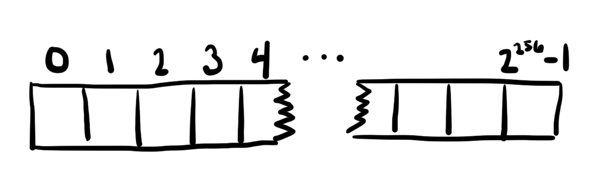
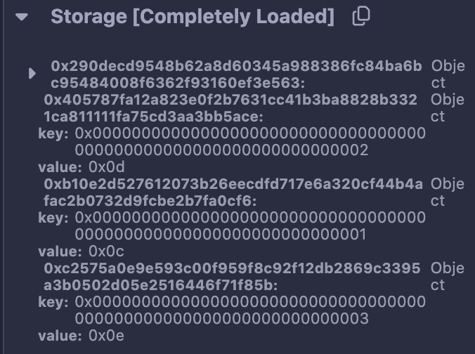

#  EVM Storage

终于要开始EVM存储的介绍了，这可以说是EVM非常重要的部分，存储也是EVM智能合约消耗燃气最可观的地方，可以说有时候，你做10个其他燃气优化都不如减少一个存储的读写来的更高效。因为有两遍非常好的文章，所以还是用偷懒式写法（说实话，写一篇文章太花费时间了），简单输出，然后大家通过阅读推荐的文章来进一步深入学习。

第一篇 [Understanding Ethereum Smart Contract Storage](https://programtheblockchain.com/posts/2018/03/09/understanding-ethereum-smart-contract-storage/) by STEVE MARX，主要将合约里怎样分配存储空间，怎样计算存储位置。
第二篇 [EVM Deep Dives Part3: Demystifying Storage Slot Packing](https://noxx.substack.com/p/evm-deep-dives-the-path-to-shadowy-3ea?s=r) by noxx，主要讲变量存储合并。


## 合约存储基础

### EVM storage 是个天文数字般巨大的数组

在以太坊虚拟机（EVM）中运行的智能合约都在其自己的存储中维护状态。合约的存储可以被认为是一个非常大的数组，最初充满了零。数组中的每个值都是32字节大小，称为一个slot插槽，共有2**256次方这样的值。智能合约可以在任何位置读取或写入值。这就是存储接口的范围。



但其实这个数据里大量的插槽都是空的，而这些插槽不分配真正的物理存储空间。所以实际上合约的物理存储中之存储了少量的值为非零的数据。同时以太坊也会通过退手续费来鼓励将插槽设置为0来释放其物理存储空间。

合约里分为固定大小的值，如 uint-n/struct/定长数组等等，也有动态的变量，如动态数据或Map。这两种类型的值在合约里有不同的位置分配机制。

#### 固定大小的位置

```js
contract StorageTest {
    uint256 a;     // slot 0
    uint256[2] b;  // slots 1-2

    struct Entry {
        uint256 id;
        uint256 value;
    }
    Entry c;       // slots 3-4
}
```
以上合约中变量会根据其在合约里声明的顺序来分配位置，如下
- a存储在槽0处。
- b存储在槽1和2中数组的每个元素一个。
- c从槽3开始并消耗两个槽，因为该Entry结构存储两个32字节值。

#### 动态大小的位置

首先给刚刚的合约添加一个值类型为Entry的动态数组
```js
contract StorageTest {
    uint256 a;     // slot 0
    uint256[2] b;  // slots 1-2

    struct Entry {
        uint256 id;
        uint256 value;
    }
    Entry c;       // slots 3-4
    Entry[] d;
}
```
合约会在插槽 slot-5 的位置存数组的长度，但数组内容会存在另外的地方，具体位置通过下面的方式计算得到，通过数组长度存储的这个槽的下标和数组下标及元素大小来计算。
```js
// keccak256 = sha256 就是hash
function arrLocation(uint256 slot, uint256 index, uint256 elementSize)
    public
    pure
    returns (uint256)
{
    return uint256(keccak256(slot)) + (index * elementSize);
}
```

现在再为合约添加一个Map
```js
contract StorageTest {
    uint256 a;     // slot 0
    uint256[2] b;  // slots 1-2

    struct Entry {
        uint256 id;
        uint256 value;
    }
    Entry c;       // slots 3-4
    Entry[] d;     // slot 5 for length, keccak256(5)+ for data

    mapping(uint256 => uint256) e;
}
```
变量e将被分配到插槽slot-6，但slot-6中什么也没存，Map的键值是根据以下方式来计算位置的，也就是键拼接插槽下标后的hash值

```js
// keccak256 = sha256 就是hash
function mapLocation(uint256 slot, uint256 key) public pure returns (uint256) {
    return uint256(keccak256(key, slot));
}
```

#### 复杂类型组合的位置

别担心，复杂数据组合的存储位置也是简单的，现在给合约添加一个Map g，键是uint256，值是uint256数据，然后再添加一个数组，值类型是Map
```js
contract StorageTest {
    uint256 a;     // slot 0
    uint256[2] b;  // slots 1-2

    struct Entry {
        uint256 id;
        uint256 value;
    }
    Entry c;       // slots 3-4
    Entry[] d;     // slot 5 for length, keccak256(5)+ for data

    mapping(uint256 => uint256) e;    // slot 6, data at h(k . 6)
    mapping(uint256 => uint256) f;    // slot 7, data at h(k . 7)

    mapping(uint256 => uint256[]) g;  // slot 8
    mapping(uint256 => uint256)[] h;  // slot 9
}
```

于是就可以用以下方式来查找g中数据的元素位置，先得到Map中，比如查找g[123][0]
```js
// 先计算 g[123] 位置
arrLoc = mapLocation(8, 123);  // g is at slot 8

// 然后计算数组元素的位置
itemLoc = arrLocation(arrLoc, 0, 1);
```
当查找h[2][456]时，可用以下方式计算得到
```js
// 先计算 h[2]
mapLoc = arrLocation(9, 2, 1);  // h is at slot 9

// 然后查找 map[456]
itemLoc = mapLocation(mapLoc, 456);
```

太棒了，现在你已经知道合约是如何存储数据的了，现在继续另外一个重要的部分

## 合并数据存储-插槽封装 Slot Packing

合约中每个插槽可以存储32bytes数据，当合约里声明了如下变量时（注意变量不再是uint256），而是更小的uint32和uint128类型。
```js
contract StorageTest {
    uint32 a;     
    uint32 b;  

    struct Entry {
        uint32 id;
        uint32 value;
    }
    Entry c;   
    uint128 d;
}
```

你可能已经猜到了，合约会把上面的变量打包在一个插槽里，32 + 32 + (32 + 32) + 128 = 256，恰好存下，当然这也导致合约在写入和读取某个变量时要做更多的运算来得到正确的结果。至于如何来计算的，是个相对复杂的过程，感兴趣的话可以看第二篇文章[EVM Deep Dives Part3: Demystifying Storage Slot Packing](https://noxx.substack.com/p/evm-deep-dives-the-path-to-shadowy-3ea?s=r) by noxx，主要讲变量存储合并。

打包存储时按照变量顺序的来做计算的，如果你的合约存储变量定义顺序如下，ab会被写入一个插槽，cde分别写入一个插槽。
```js
// SPDX-License-Identifier: MIT
pragma solidity ^0.8.24;

contract Case003 {
    uint128 private a;
    uint128 private b;
    uint128 private c;
    uint256 private d;
    uint128 private e;

    function setAB() public {
        a = 10;
        b = 11;
    }

    function setCDE() public  {
        c = 12;
        d = 13;
        e = 14;
    }

    function viewAll() view public returns(uint128, uint128, uint128, uint256, uint128) {
        return (a, b, c, d, e);
    }
}
```



数组的存储也会打包的，不妨试试如下合约
```js
contract Case003 {
    uint64[] public numbers;
   
    function add(uint64 n) public {
        numbers.push(n);
    }

    function size() external view returns (uint256) {
        return numbers.length;
    }
}

```
也可以试试定长数组
```js
contract Case003 {
    uint64[8] public numbers;
   
    function add(uint i, uint64 n) public {
        numbers[i] = n;
    }
}

// 当你 执行 add(5, 8) 和 add(7, 8) 因为它们都被打包到slot-1中了，
// 所以你会发现slot-1的值如下
// 0x0000000000000008000000000000000000000000000000080000000000000000
```

打包也是一个非常有效节约燃气消耗的方式

好吧，这就是合约存储的位置分配和插槽打包的内容～，感谢上文提到的两篇文章的作者，强烈推荐大家阅读他们的文章。

### 推荐阅读
- [Understanding Ethereum Smart Contract Storage](https://programtheblockchain.com/posts/2018/03/09/understanding-ethereum-smart-contract-storage/) by STEVE MARX，主要将合约里怎样分配存储空间，怎样计算存储位置。
- [EVM Deep Dives Part3: Demystifying Storage Slot Packing](https://noxx.substack.com/p/evm-deep-dives-the-path-to-shadowy-3ea?s=r) by noxx，主要讲变量存储合并。
- [EVM Deep Dives Part4: Under The Hood - Storage Opcodes In the Go Ethereum (Geth) Client](https://noxx.substack.com/p/evm-deep-dives-the-path-to-shadowy-5a5?s=r)