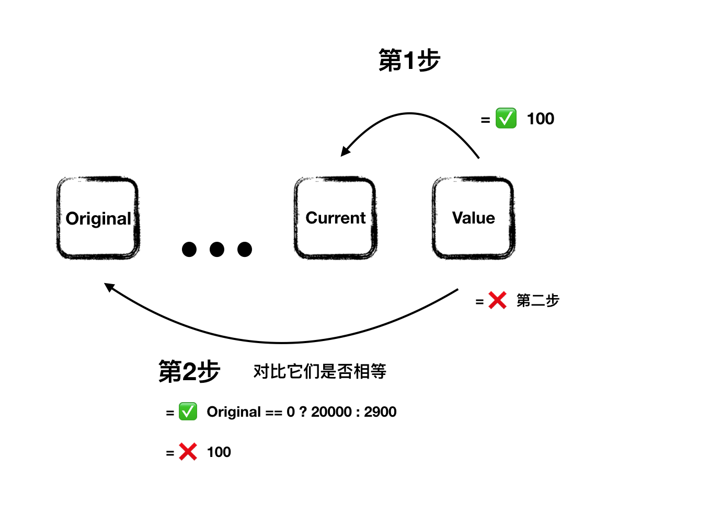
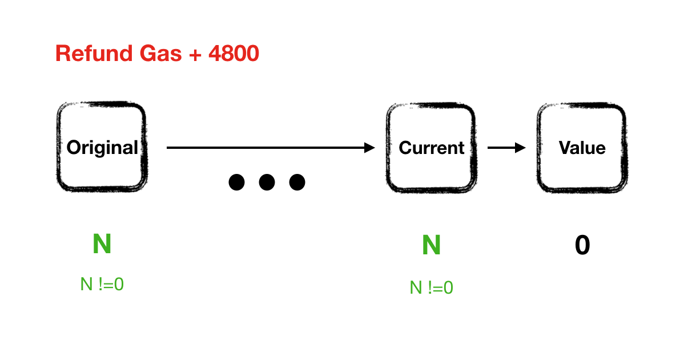
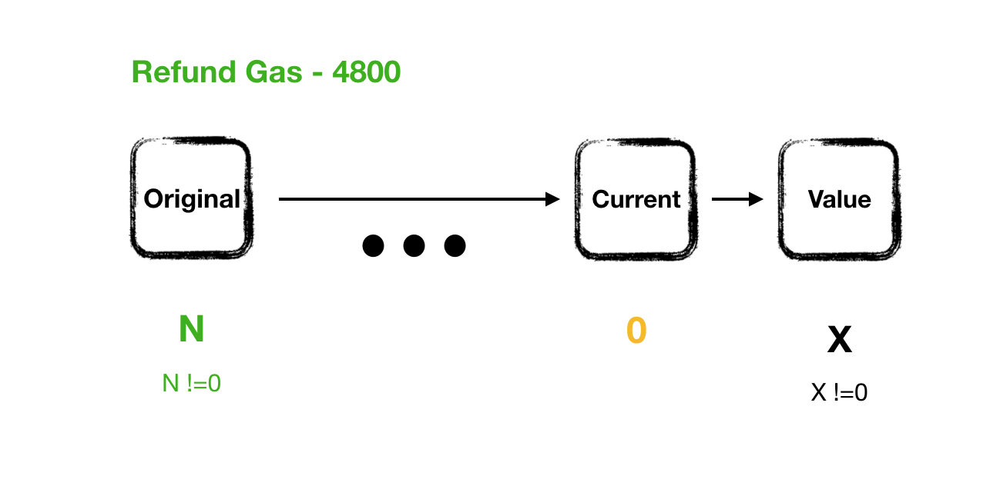
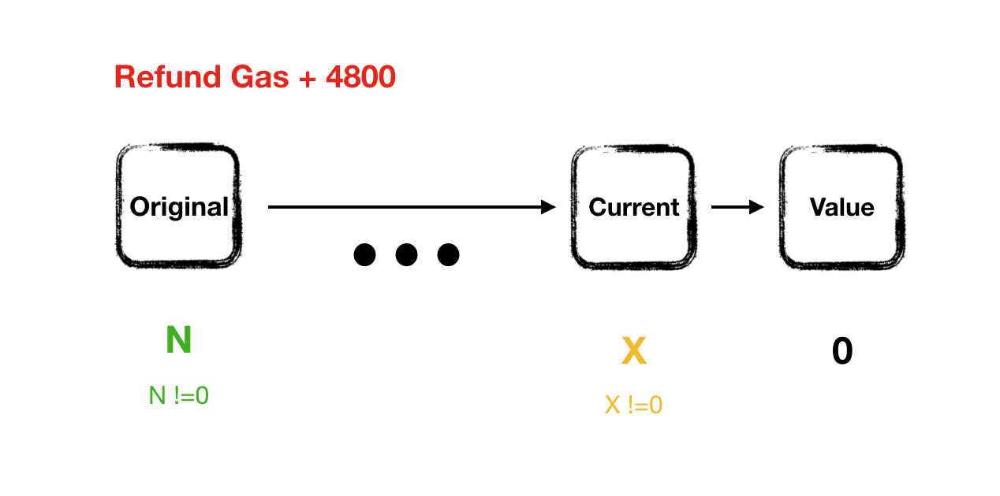
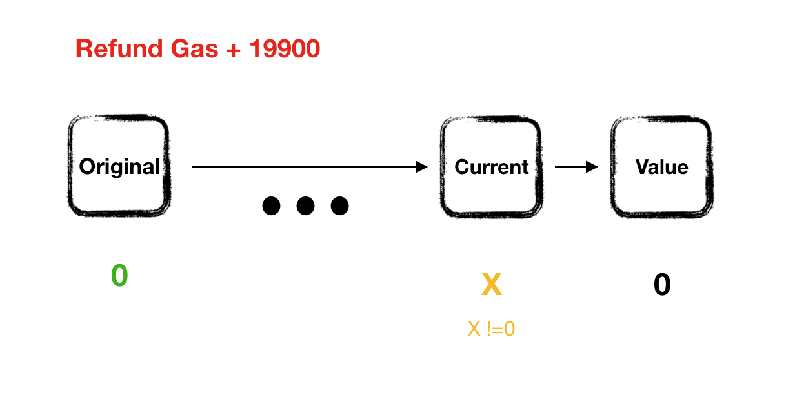
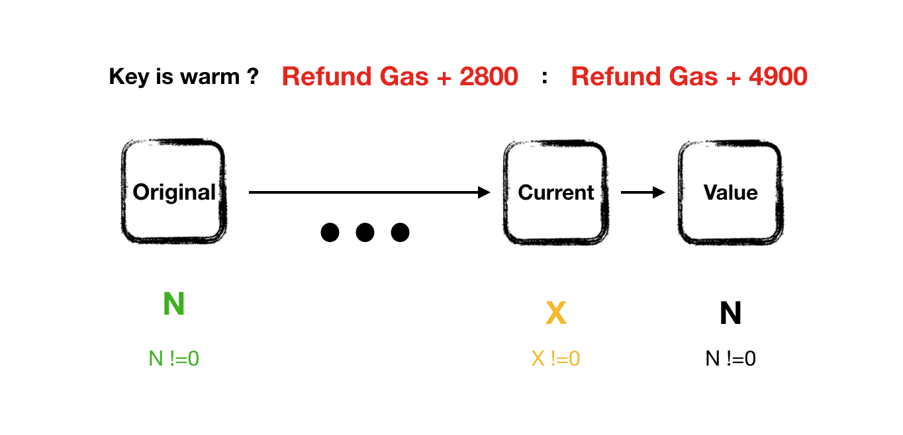

# Storage 读写燃气消耗

在计算机系统中，CPU计算是非常快速的，但是读写硬盘相对是非常慢的，写入硬盘就被认为完成数据持久化。EVM在长时间的发展过程里，逐渐的完善了存储数据读写的燃气收费规则，尽管现在计算机处理能力非常强，但作为一个全球公共基础计算机，以太坊的状态空间还是稀缺的，所以合约数据持久化链上存储收费很贵。为了鼓励大家释放不再使用的状态空间，以太坊实现一套退费规则，但目前退费最多只能是总燃气消耗的20%（之前50%），当前退费所达到的效果一般。

存储收费这部分是合约燃气消耗必须掌握的重要知识。

首先介绍一个cold（冷）/ warm（热）插槽的概念，在一个存储插槽在交易中没有被访问过的时候它的状态是cold冷的，一旦这个插槽在这比交易被读或写过，它就变成warm，也就是热的，EVM在插槽读写操作时候（SLOAD/STORE）判断其冷热状态来不同计费。后面还会介绍到一个AccessSet的机制，大概就是在交易提交时候可以预先声明会使用到的插槽，这样就可以把插槽预热，当然AccessSet也是收费，但会有一定的节约。

### 读存储插槽
##### 收费规则

规则很简单，当插槽是冷状态消耗燃气2100，热状态收费100.

### 写入存储插槽

写入包括收费和退费两部分规则，先来看收费部分

##### 收费规则
收费规则定义如下 复制于 [EVM.codes](https://www.evm.codes/#55?fork=shanghai)
```js
// value: value from the stack input.
// current_value: current value of the storage slot.
// original_value: value of the storage slot before the current transaction.
// static_gas = 0

if value == current_value
    if key is warm
        base_dynamic_gas = 100
    else
        base_dynamic_gas = 100
else if current_value == original_value
    if original_value == 0
        base_dynamic_gas = 20000
    else
        base_dynamic_gas = 2900
else
    base_dynamic_gas = 100

// On top of the cost above, 2100 is added to base_dynamic_gas if the slot is cold. See section access sets.
```

当然这个公式很容易看懂，但是不容易记住，上面提到，当插槽是冷的状态时候，操作要加2100gas。


##### 退费规则
```js
if value != current_value
    if current_value == original_value
        if original_value != 0 and value == 0
            gas_refunds += 4800
    else
        if original_value != 0
            if current_value == 0
                gas_refunds -= 4800
            else if value == 0
                gas_refunds += 4800
        if value == original_value
            if original_value == 0
                if key is warm
                    gas_refunds += 20000 - 100
                else
                    gas_refunds += 19900
            else
                if key is warm
                    gas_refunds += 5000 - 2100 - 100
                else
                    gas_refunds += 4900
```

其实就是这5种情况，其中第五种会区分插槽的冷热状态






即便退费限制在最多只能是合约消耗的20%，也是一个可观的数字，一定要利用好退费规则。

### AccessSet
以太坊团队在EIP-2929中调整了存储读写的燃气消耗，原来读一个插槽大概固定700gas，现在冷插槽需要2100gas，这使得以前开发的合约，在调用另外一个合约时候会限制燃气消耗，当EIP-2929上涨之后导致原来的调用可能失败，为了向前兼容，EIP-2930提供了AccessSet这个解决方案，就是在提交交易的时候，把你要用到的合约以及会读写到的插槽放在AccessList里，这样就能预热插槽，把插槽读费用降到100。每个AccessList项收费1900gas，相当于每个地址读可节省100gas，也是一种可以节省燃气的方式。还有在合约调用中，EXTCODECOPY及STATICCALL等opcode也会根据调用合约地址的冷热状态来不同收费，将被调用地址放入AccessList也可以节省100gas。

影响到的操作码有[SLOAD (0x54), CALL (0xf1),CALLCODE (0xf2), DELEGATECALL (0xf4), STATICCALL (0xfA), BALANCE (0x31), EXTCODESIZE (0x3b), EXTCODECOPY (0x3c), EXTCODEHASH (0x3f)]

```js
[
    [
        "0xde0b295669a9fd93d5f28d9ec85e40f4cb697bae",
        [
            "0x0000000000000000000000000000000000000000000000000000000000000003",
            "0x0000000000000000000000000000000000000000000000000000000000000007"
        ]
    ],
    [
        "0xbb9bc244d798123fde783fcc1c72d3bb8c189413",
        []
    ]
]
```

### EIPS

推荐几个关于燃气消耗的EIP，可去[EIP网站](https://eips.ethereum.org/all)查看

- EIP-2929 Gas cost increases for state access opcodes
- EIP-2028 Transaction data gas cost reduction 
- EIP-3529 Reduction in refunds
- EIP-2200 Structured Definitions for Net Gas Metering
- EIP-1559 Fee market change for ETH 1.0 chain

