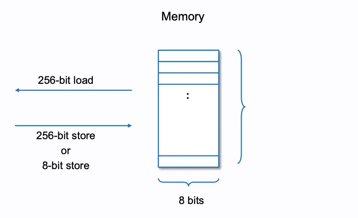
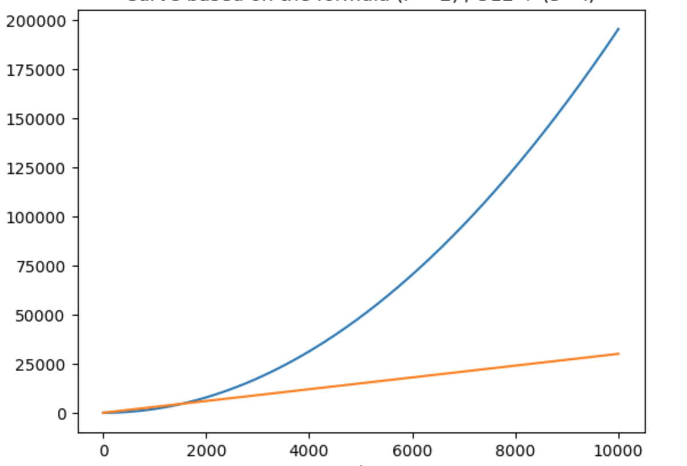

# Memory 合约内存

### EVM中内存排列方式

合约内存是个字节数组，数据以32bytes（256bit）或1byte（8bit）的块为单位存储，以32bytes块为单位读取。

图片来源: https://takenobu-hs.github.io/downloads/ethereum_evm_illustrated.pdf


### 相关操作码及燃气收费规则

与内存操作直接相关的3个操作码
```
51  MLOAD               | 3gas，从内存某个位置加载32bytes数据到stack
52  MSTORE              | 3gas + 动态消耗，写32bytes到memory
53  MSTORE8             | 3gas + 动态消耗，写1byte到memory
```

由于MSTORE（32bytes）和MSTORE8（1byte）写入的内存字节较少，所以燃气消耗非常低，不会造成大量燃气消耗，真正可能造成大量燃气消耗的是CALLDATACOPY操作码，它会复制n*32bytes数据到内存，可能消耗大量燃气。然后下面还列了CODECOPY/EXTCODECOPY/RETURNDATACOPY 3个操作码，这些操作码也是写入内存操作，因为其复制受限于被复制的内容大小，所以很少能让内存使用暴涨，如果是为了消耗燃气而写攻击方法，CALLDATACOPY可能会更有效。

```
37  CALLDATACOPY    | 3gas + 动态消耗，复制calldata的某个位置后的所有字节到内存，一般用于初始化变量
	
39  CODECOPY        | 3gas + 动态消耗，把合约的指定部分字节码复制到内存
3C  EXTCODECOPY     | 3gas + 动态消耗，把外部某个合约的指定部分字节码复制到内存
3E  RETURNDATACOPY  | 3gas + 动态消耗，把方法调用返回结果复制到内存
```

动态内存消耗费用的计算如下
```
memory_size_word = (memory_byte_size + 31) / 32
memory_cost_mul = (3 * memory_size_word)
memory_cost_pow = (memory_size_word ** 2) / 512 
memory_cost = memory_cost_mul + memory_cost_pow
```

上面内存收费memory_cost由memory_cost_mul和memory_cost_pow两部分构成，memory_cost_mul是32bytes * 3，线性增长，memory_cost_pow是一个指数函数，增长逐渐变快，当它小于512的时候增长缓慢，当到1024时收费2048 gas，当增长到1536的时候，memory_cost_pow的燃气消耗会逐渐超过memory_cost_mul，并以惊人的速度增长。

这可以看作是EVM对大量使用内存征收的一个的重税。可以说EVM提倡才少量KB内完成工作。这也是其作为全球计算机系统和日常工作娱乐用的计算机系统的不同。



### 一个简单的测试用例
```js
pragma solidity ^0.8.24;

contract Case_005 {
    // 3853 gas cost
    function a() public payable {
        uint256[512] memory numbers; // 3697 gas cost
        numbers[511] = 1; // 66 gas cost
    }

    // 8491 gas cost
    function b() public payable {
        uint256[1024] memory numbers; // 8313 gas cost
        numbers[1023] = 1; // 66 gas cost
    }

    // 14175 gas cost
    function c() public payable {
        uint256[1536] memory numbers; // 15385 gas cost
        numbers[1535] = 1; // 66 gas cost
    }

    // 20817  gas cost
    function d() public payable {
        uint256[2048] memory numbers; // 20617
        numbers[2047] = 1; // 66 gas cost
    }

    // 37261 gas cost
    function e() public payable {
        uint256[3072] memory numbers; // 37017 gas cost
        numbers[3071] = 1; // 66 gas cost
    }
}
```

把方法e()中的`uint256[3072] memory numbers;`语句的字节码截取出来分析一下，燃气主要消耗在CALLDATACOPY操作码这一步，这一步给numbers初始化为值为0的数组写入memory，消耗燃气20518 gas。

```
60405180620180000160405280610c0090602082028036833780820191505090505090565b
```
对应操作码
```
[00]	PUSH1	40
[02]	MLOAD	
[03]	DUP1	
// 0x80 + 0x18000, new free memory location pointer, 0x18000 = 97152 = 3036 * 32
[04]	PUSH3	018000
[08]	ADD	
[09]	PUSH1	40
[0b]	MSTORE	
[0c]	DUP1	
[0d]	PUSH2	0c00
[10]	SWAP1	
[11]	PUSH1	20
[13]	DUP3	
[14]	MUL	
[15]	DUP1	
[16]	CALLDATASIZE	
[17]	DUP4	
// init numbers use byte 0 
[18]	CALLDATACOPY	
[19]	DUP1	
[1a]	DUP3	
[1b]	ADD	
[1c]	SWAP2	
[1d]	POP	
[1e]	POP	
[1f]	SWAP1	
[20]	POP	
[21]	POP	
[22]	SWAP1	
[23]	JUMP	
[24]	JUMPDEST
```


### 推荐阅读
[EVM Deep Dives 2: Let's take a trip down memory lane](https://noxx.substack.com/p/evm-deep-dives-the-path-to-shadowy-d6b?s=r)
NOXX 2022年3月6日
