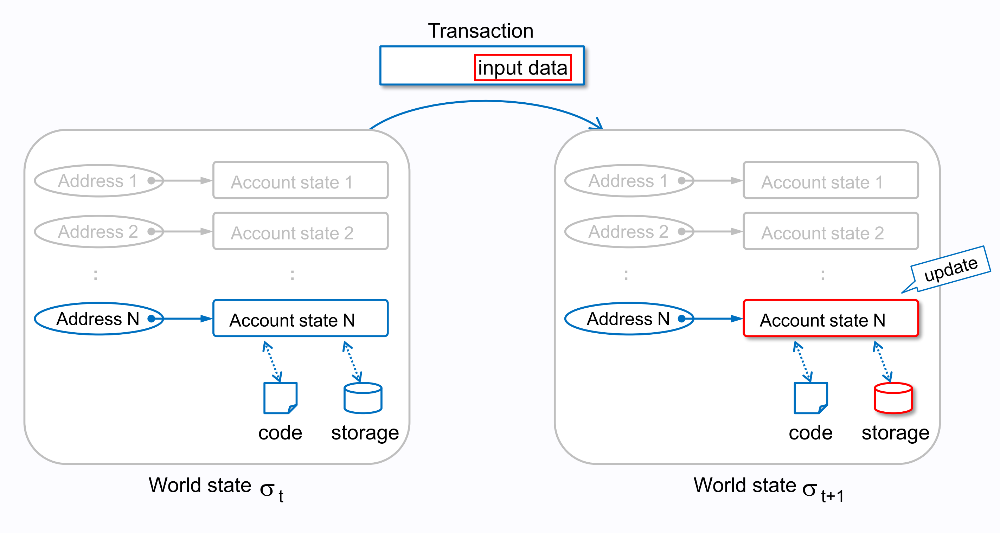

# 日志event收费

### 交易日志
在以太坊中有3个核心的数据组织，账户状态数据，交易数据以及交易结果数据。

- 以太坊将所有账户状态数据维护在StateDB中，所谓账户状态数据包括外部账户和合约账户，外部账户状态主要有账户[balance,nonce]，合约账户主要包括[balance,nonce,code,storage]，code时合约字节码，storage是合约存储的所有数据；
- 交易数据是所有由外部账户提交的交易列表，每个交易都是原子性的（要么执行成功，要么什么也不做），执行成功的交易会导致账户状态数据的更新；
- 交易结果数据，交易执行的结果数据，包括交易hash，块hash和交易日志等；



以上三个部分数据在以太坊节点上单独组织及存储。当我们提交一笔交易后，我们可以通过查看交易结果来查看交易是否成功。但当我们想要在交易成功后让关系交易状态的合作者也能第一时间得到交易结果的消息，那么就要用到交易日志了。比如我们都知道在ERC20转账时，会有一条transfer日志，这样区块链钱包就可以通过监听transfer消息来及时知道一笔交易已经发生。

比如这个ERC20转账，0x5B38Da6a701c568545dCfcB03FcB875f56beddC4给0xAb8483F64d9C6d1EcF9b849Ae677dD3315835cb2转账2000000000000000000wei
```
{
    "from": "0x5B38Da6a701c568545dCfcB03FcB875f56beddC4",
    "to": "0xAb8483F64d9C6d1EcF9b849Ae677dD3315835cb2",
    "value": "2000000000000000000"
}
```


一个非常重要的点是交易结果和区块头中都有一个Bloom过滤器字节数组，这帮助我们可以快速的通过索引的topic字段来检索一个交易或者一个块中有没有想过日志，我们可以用节点提供的日志接口去获取区块n-m间的某个Topic相关的所有日志。

还有一点我们要清晰的认识到，以太坊状态数据只表达了这个数据的最终状态，而如何从初始值到达最终这个状态的过程数据，在状态数据里是没有维护的，而日志数据正是我们来记录整个过程最有效的方式，在实现一些显示业务中这也是很重要的，比如ERC20协议中的日志使用就是一个非常好的实现。

### 日志收费
由于交易结果数据一旦写入，将不再改变，后续只需要被检索查询，所以比状态数据维护成本要低很多，所以这部分数据的收费也是比较低的。

Solidity日志的写法相关我们就不用说了，需要注意的是非匿名事件最多可以设置3个索引topic（日志签名是第一个Topic），非索引数据都将放在log data数据中。因为日志的写入最终会转换成opcode，根据索引Topic参数的数量被编译成以下5个opcode中一种，每多一个topic，多375gas。

```
A0 LOG  offset,size                                    | 375
A1 LOG1 offset,size,topic1                             | 750
A2 LOG2 offset,size,topic1,topic2                      | 1125
A3 LOG3 offset,size,topic1,topic2,topic3               | 1500
A4 LOG4 offset,size,topic1,topic2,topic3,topic4        | 1875
```

其实日志收费不只是固定的收费部分，也有部分是根据日志内容的内存收费，公式如下。size是字符byte数，memory_expansion_cost是导致内存扩展所花费的燃气。

```
gas = 375 * topic_count + 8 * size + memory_expansion_cost
```

### 一个小案例
我们来实现一个献血积分的合约，首先合约要记录某个人的献血记录，然后这个人可以根据自己的献血记录来获取一些社会福利。就像你可以通过芝麻信用分来免押金一样，你可以在一些情况下向某个服务你够授权你的献血积分来获得机构的服务。方式就是你在链上提交一笔交易，最终触发一个Approval日志，当服务机构监听到链上的这笔日志消息后，确定你要足够积分就可以为你提供服务。

我们要实现以下几点功能
1. 用户可自己注册成为会员，注册过程将用户ID与账户绑定，只有会员才能积分；
2. 献血记录，由合约Owner提交；
3. 可根据用户ID或者账户地址来查看积分；
4. 当用户丢失账户私钥时，可通过线下申请把积分转移到新的账户，由合约Owner提交交易处理；
5. 合约Owner根据情况对用户做积分惩罚；
6. 用户可通过提交一笔交易来向特定机构证明自己的积分；

让我们先来定义一下接口内容

```js
interface IDonate {
    // 注册消息
    event Register(uint256 indexed userId, address indexed account);
    /**
     * 捐赠记录
     * @dev Emitted by donate submit
     *
     */
    event Donate(uint256 indexed userId, uint256 amount);
    /**
     * 某些情况下对用户做出惩罚记录
     * @dev Emitted by punish submit
     *
     * Note that {msg} 是 惩罚原因
     */
    event Punish(address indexed userId, uint256 amount, string msg);
    // 基本转移给自己的新账户
    event Transfer(address indexed from, address indexed to);
    event Approval(uint256 indexed userId, uint256 indexed serviceId, uint256 score);
    /**
     * 积分验证
     * @dev Emitted when approval submit
     *
     * {serviceId} 服务机构ID
     * {score} 账户积分
     * {minLimit} 服务机构要求分
     */
    event Approval(uint256 indexed userId, uint256 indexed serviceId, uint256 score, uint256 minLimit);

    function register(uint256 userId) external;
    function isRegisted(uint256 userId) external view returns (address);
    function transfer(uint256 userId, address to) external;
    function donate(uint256 userId, uint256 amount) external;
    function punish(uint256 userId, uint256 amount, string calldata msg) external;
    function scoreOf(address account) external view returns (uint256);
    function scoreOf(uint256 userId) external view returns (uint256);
    // 向某个机构验证记录，只需要验证积分值
    function approval(uint256 userId, uint256 to) external;
    // 向某个机构验证记录，需要验证积分值  >= value才可以
    function approval(uint256 userId, uint256 to, uint256 value) external;
}

```

合约的具体实现在 contracts/Case_006.sol

可以看到在我们的合约里只记录用户积分状态，并不记录捐赠过程，而是通过日志来记录，然后通过一个验证交易日志里放入一个服务机构的id来做验证授权，这样机构可以根据自己的ID来监听链上日志的到授权记录；当然这只是一个简单的小案例，我们知道ERC20就已经是一个非常棒的案例了，但有一点不同的是，在一些真实场景里，用区块链账户完全表达一个真实会遇到一些问题，比如私钥丢失，专户转移等等，所以我们在业务中还是保持用userId和账户做一个绑定，以提供更灵活的方案。

在我们的案例中，有两个索引的Topic，对应LOG3操作码，话费1500gas


### 推荐阅读
- [EVM Deep Dives 6: Transaction Receipts & Event Logs](https://noxx.substack.com/p/evm-deep-dives-the-path-to-shadowy-16e) NOXX 2022年6月27日
- [Understanding event logs on the Ethereum blockchain](https://medium.com/mycrypto/understanding-event-logs-on-the-ethereum-blockchain-f4ae7ba50378) Luit Hollander Mar 5, 2020