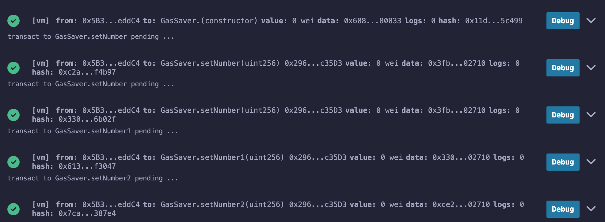
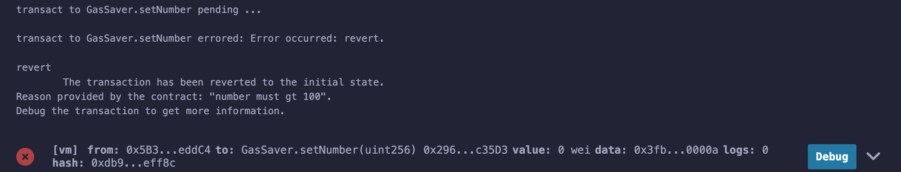
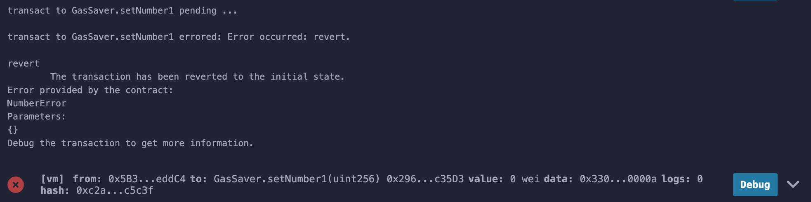
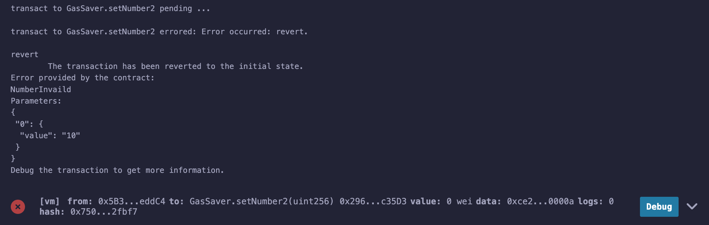

# revert vs require

### 源码及注释
```js
// SPDX-License-Identifier: MIT
pragma solidity ^0.8.24;

error NumberError();
error NumberInvaild(uint256);

contract Case_102 {
    uint256 public number;

    // step 0-29 118 gas cost before
    function setNumber(uint256 n) public { // step 30-112 | 273 gas | 6096 gas left
        // step 113-118 | 23 gas | 5825 gas left <- success
        // step 113-208 | 316 gas <- revert
        require(n > 100, "number must gt 100"); 
        number = n; // step 119-127 | 2223 gas | 5802 gas left
    }

    // step 0-24 96gas cost before
    function setNumber1(uint256 n) public { // step 25-107 | 273 gas | 6094 left
        if (n <= 100) { // step 108-113 | 23 gas cost | 5822 left
            revert NumberError(); // step 113-126 | 45 gas
        }
        number = n; // step 114-121 | 2223 gas cost | 5799 left
    }

    // step 0-39 162 gas cost before
    function setNumber2(uint256 n) public { // step 40-122 | 273 gas | 6104 left
        if (n <= 100) { // step 123-128 | 23gas cost | 5822 left
            revert NumberInvaild(n); // step 128-188 | 197 gas
        }
        number = n; // step 129-137 | 2223 gas cost | 5809 left
    }
}
```
### 结果分析
##### 当参数n=10时导致终断执行时的燃气消耗
calldata 消耗 64gas(方法签名) + 140gas(参数10) = 204gas
初始燃气消耗 21000 + 204 = 21204gas

| Method   | Gas Limit | Transaction Cost  | Execution Cost |
| -------- | -------- | -------- | -------- |
| setNumber  | 0x3fb5c1cb | 21910 | 706 |
| setNumber1 | 0x3307a982 | 21639 | 435  |
| setNumber2 | 0xce29371b | 21857 | 653 |


##### 当参数n=10000时导致终断执行时的燃气消耗
10000 = 0000000000000000000000000000000000000000000000000000000000002710
calldata 消耗 64 gas(方法签名) + 140 gas(参数10) = 216 gas
初始燃气消耗 21000 + 204 = 21216 gas

| Method   | Gas Limit | Transaction Cost  | Execution Cost |
| -------- | -------- | -------- | -------- |
| setNumber  | 0x3fb5c1cb | - | 23853 | 2637 |
| setNumber1 | 0x3307a982 | 27406 | 23831 | 2615  |
| setNumber2 | 0xce29371b | 27482 | 23897 | 2681 |

通过opcode调试，我们知道 setNumber2比setNumber1在进入方法的过程多消耗了66gas。方法执行消耗完全一样；

为什么相差66gas，因为number是public，在编译时自动为其生成了number()方法，所以进入方法的匹配过程变成了以下顺序，我们在Case_001中讲过，一次失败的匹配会话费22gas
```
0x3307a982 setNumber1()
0x3fb5c1cb setNumber
0x8381f58a number()
0xce29371b setNumber2()
```



setNumber revert

setNumber1 revert

setNumber2 revert


通过提交失败信息我们可以看到，当我以revert error的方式终断执行，错误信息包括错误名和参数，所以我们在命名错误的时候一定要用能描述错误的名字，否则，比如NumberError就很难描述具体的错误。

### 更进一步
我们发现，当我们添加一个参数给错误时候，会增加大概150gas，那如果我们添加更多参数会怎样？
```js
// 当2个uint256参数时，revert消耗 299 gas
error NumberInvaild(uint256, uint256);
// 当3个uint256参数时，revert消耗 401 gas 
error NumberInvaild(uint256, uint256, uint256);
```
setNumber中revert消耗了大概316-22 = 296gas，与两个uint256参数NumberInvaild差不多，当error参数更多时候会变得更贵。所以只有当参数比较少的时候revert error会更节省gas。

当我们用下面两行代码时会有非常大的差异，为什么？
```js
revert NumberInvaild(n, n)
revert NumberInvaild(n, 1)
```